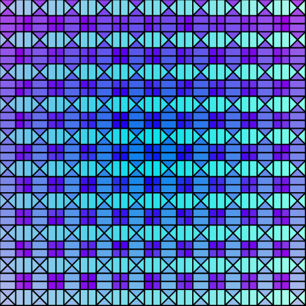
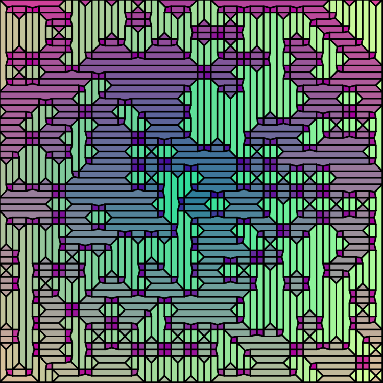

# JOpenVoronoi+

A fork of *Rogach*'s [port](https://github.com/Rogach/jopenvoronoi) of the original C++ library [openvoronoi](https://github.com/aewallin/openvoronoi) — a library capable of creating 2D point & line-segment Voronoi diagrams and medial axes.

# Fork Changes

This fork has the following changes:

- Converts source code to Java 11
- Introduces cell-point methods:
  - `nearestFace()` 
  - `nearestFaces()`
- Removes the *tests* maven sub-module and brings the main library up to the top level (so it's easily hostable as an artifact via JitPack)
- Splits the library into appropriate sub-packages
- Converts source comments into proper Javadoc comments (only the most important comments converted so far...)
- Removes the constraint that point sites had to be placed within a unit-circle centered on (0,0) — now points can have any coordinate! (this could have side-effects...)
- Introduces *LindenmayerCurve*, *RandomLabyrinth* and *RandomPolygon* diagram generators (from the original's tests) into the main library under the *generate* sub-package
- Introduces `buildIntoVoronoiDiagram()` for PlanarGraphs
- Adds Javadoc comments to important arguments on generator classes
- Removes SVG output functionality
- Removes the debugging `step` argument (that was left in the code) from the main point/site insert methods
- Implements `position()` on `Edge`, `LineSite` and `Pointsite` classes
- Replace diagram's `HashSets` with `ArrayLists` for easier iteration
- More error handling

# Example code


```java
import org.rogach.jopenvoronoi.*;

VoronoiDiagram voronoi = new VoronoiDiagram();
HalfEdgeDiagram diagram = voronoi.getDiagram();

voronoi.getFaces().forEach(face -> {

    Point pos = face.site.position();
    diagram.face_edges(face).forEach(edge -> {
        vertex(edge.source.position.x, edge.source.position.y);
        vertex(edge.target.position.x, edge.target.position.y);
    });
});
```

# Images

### Labryinth

<h1 align="center">
  </a>
</h1>
<h1 align="center">
  </a>
</h1>

### Nearest Faces 

<h1 align="center">
  </a>
</h1>

n = 10
<h1 align="center">
  </a>
</h1>

License
=======
JOpenVoronoi is released under GPLv3 (see COPYING), same as it's parent
 [openvoronoi](https://github.com/aewallin/openvoronoi) project.