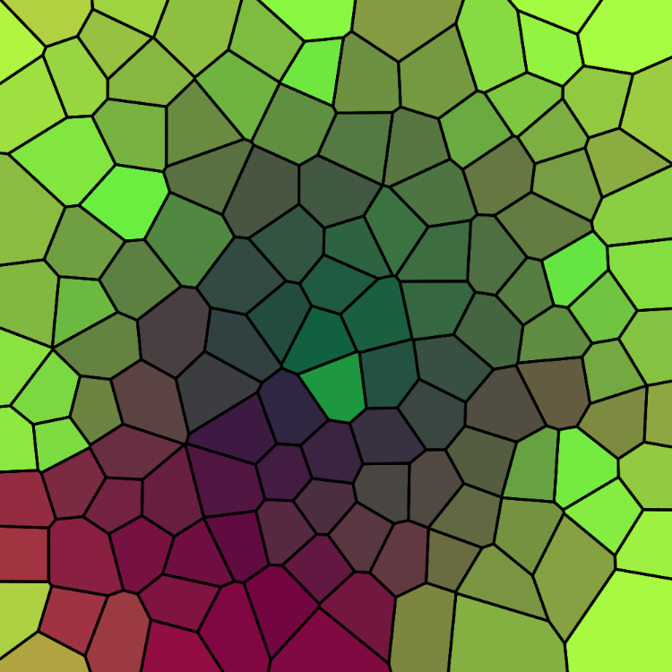
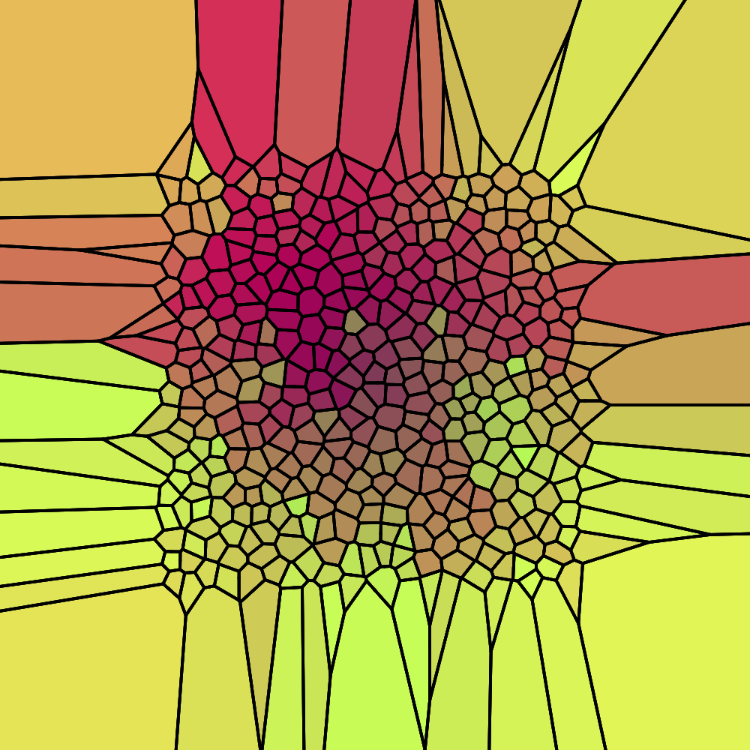
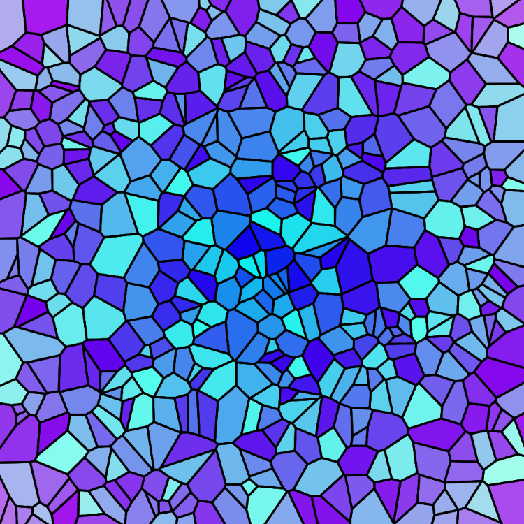
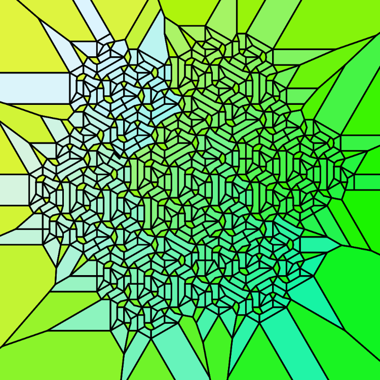
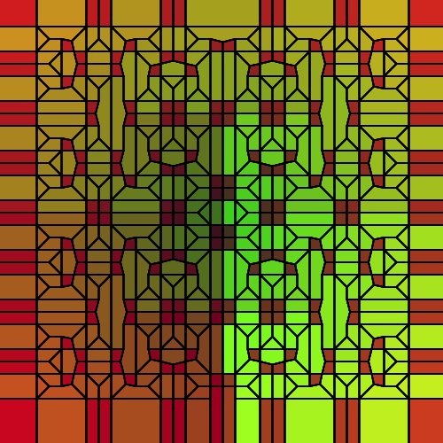
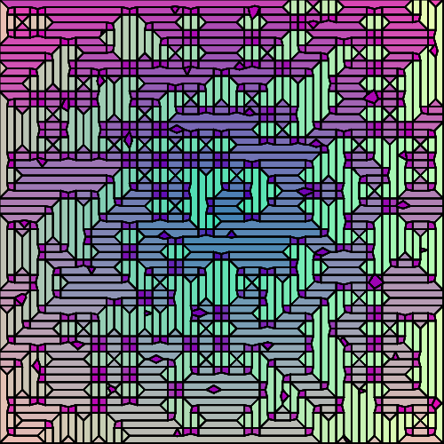
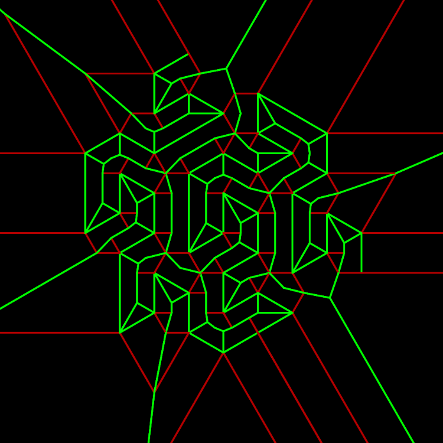
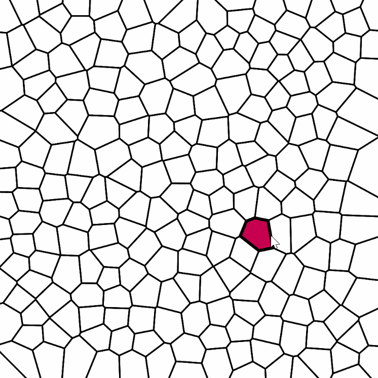
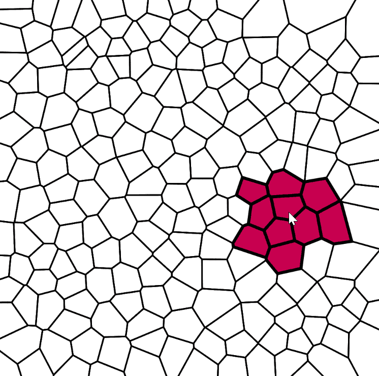

# JOpenVoronoi+

A fork of *Rogach*'s [port](https://github.com/Rogach/jopenvoronoi) of the original C++ library [openvoronoi](https://github.com/aewallin/openvoronoi).

# Features

- Incremental Voronoi Point & Line Site Diagrams
- Voronoi Diagram Generators: Labryinth, L-Systems
- Diagram Medial Axis
- Nearest N cells to point

# Fork Changes

This fork has the following changes:

<details>
  <summary>Click to expand!</summary>
  
- Converts source code to Java 11
- Introduces cell-point methods:
  - `nearestFace()` 
  - `nearestFaces()`
- Removes the *tests* maven sub-module and brings the main library up to the top level (so it's easily hostable as an artifact via JitPack)
- Splits the library into appropriate sub-packages
- Converts source comments into proper Javadoc comments (only the most important comments converted so far...)
- Removes the constraint that point sites had to be placed within a unit-circle centered on (0,0) — now points can have any coordinate! (this could have side-effects...)
- Introduces *LindenmayerCurve*, *RandomLabyrinth* and *RandomPolygon* diagram generators (from the original's tests) into the main library under the *generate* sub-package
- Introduces `buildIntoVoronoiDiagram()` for PlanarGraphs
- Adds Javadoc comments to important arguments on generator classes
- Removes SVG output functionality
- Removes the debugging `step` argument (that was left in the code) from the main point/site insert methods
- Implements `position()` on `Edge`, `LineSite` and `Pointsite` classes
- Replace diagram's `HashSets` with `ArrayLists` for easier iteration
- More error handling
</details>


# Example code


```java
import org.rogach.jopenvoronoi.*;

VoronoiDiagram voronoi = new VoronoiDiagram();
for (int i = 0; i < 100; i++) {
  voronoi.insert_point_site(Math.random(), Math.random());
}

HalfEdgeDiagram diagram = voronoi.getDiagram();

voronoi.getFaces().forEach(face -> {
    Point pos = face.site.position();
    diagram.face_edges(face).forEach(edge -> {
        vertex(edge.source.position.x, edge.source.position.y);
        vertex(edge.target.position.x, edge.target.position.y);
    });
});
```

# Images

## Voronoi

<table>
  <tr>
    <td>Voronoi from poisson disc points</td>
     <td>Voronoi from poisson disc points (bounded)</td>
  </tr>
  <tr>
    <td valign="top"></td>
    <td valign="top"></td>
  </tr>
 </table>

 <table>
  <tr>
    <td>Voronoi from random points</td>
     <td>3 line sites</td>
  </tr>
  <tr>
    <td valign="top"></td>
    <td valign="top"></td>
  </tr>
 </table>

## Generators

<table>
  <tr>
    <td>Gosper Curve</td>
     <td>Moore Curve</td>
  </tr>
  <tr>
    <td valign="top"></td>
    <td valign="top"></td>
  </tr>
 </table>

 <table>
  <tr>
    <td>Labryinth</td>
     <td>Medial Axis (green)</td>
  </tr>
  <tr>
    <td valign="top"></td>
    <td valign="top"></td>
  </tr>
 </table>

<!-- <p float="middle">
  
  
  
  
</p> -->

## Nearest Faces 

<p float="middle">
  
  
</p>

License
=======
JOpenVoronoi is released under GPLv3, just like its parent
 [openvoronoi](https://github.com/aewallin/openvoronoi) project.